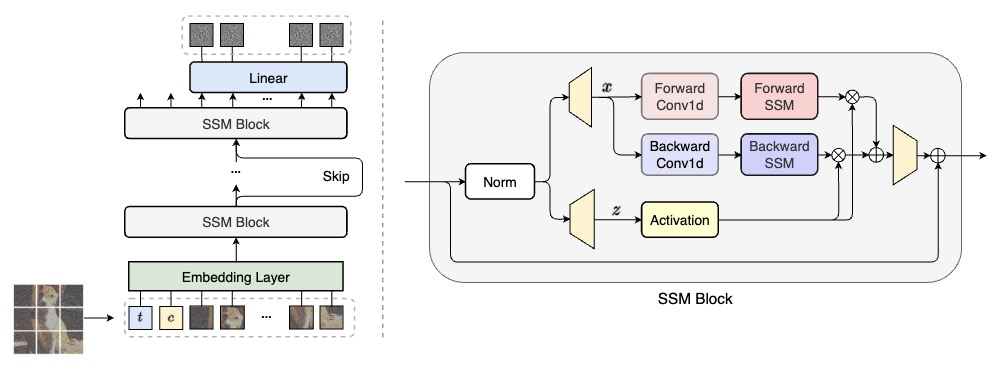

## Scalable Diffusion Models with State Space Backbone （DiS）<br><sub>Official PyTorch Implementation</sub>

This repo contains PyTorch model definitions, pre-trained weights and training/sampling code for our paper exploring diffusion models with state space backbones (DiSs).

 

* 🪐 A PyTorch [implementation](models_dis.py) of DiS
* ⚡️ Pre-trained checkpoints in paper
* 💥 A [sampling script](sample.py) for running pre-trained DiS
* 🛸 A DiS [training script](train.py) using PyTorch DDP


### Environments

- Python 3.10
  - `conda create -n your_env_name python=3.10`

- Requirements file
  - `pip install -r requirements.txt`

- Install ``causal_conv1d`` and ``mamba``
  - `pip install -e causal_conv1d`
  - `pip install -e mamba`


### Training 

We provide a training script for DiS in [`train.py`](train.py). This script can be used to train unconditional, class-conditional DiS models, it can be easily modified to support other types of conditioning. To launch DiS-L/2 (256x256) training with `N` GPUs on one node:

```bash
torchrun --nnodes=1 --nproc_per_node=N train.py \
--model DiS-L/2 \
--dataset-type imagenet \
--data-path /path/to/imagenet/train \
--image-size 256 \
--task-type class-cond \
--num-classes 1000 
```
There are several additional options; see [`train.py`](train.py) for details. 
All experiments in our work of training script can be found in `script`. 


For convenience, the pre-trained DiS models can be downloaded directly here as well:

| DiT Model     | Image Resolution | FID-50K | 
|---------------|------------------|---------|
| [DiS-S/2] | 32x32          | -    | 
| [DiS-S/2] | 64x64          | -    | 
| [DiS-L/2] | 256x256          | -    | 
| [DiS-L/2] | 512x512          | -    | 


### Evaluation

We include a [`sample.py`](sample.py) script which samples images from a DiS model. Besides, we support other metrics evaluation in [`test.py`](test.py) script. 


### Acknowledgments

The codebase is based on the awesome [DiT](https://github.com/facebookresearch/DiT), [U-ViT](https://github.com/baofff/U-ViT), and [Vim](https://github.com/hustvl/Vim) repos. 


