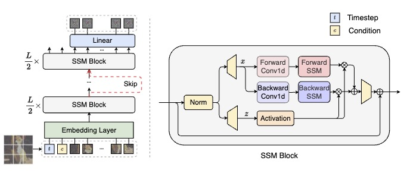

## Scalable Diffusion Models with State Space Backbone （DiS）<br><sub>Official PyTorch Implementation</sub>

[](https://arxiv.org/abs/2402.05608)


This repo contains PyTorch model definitions, pre-trained weights and training/sampling code for our paper exploring diffusion models with state space backbones (DiSs).
Our model treats all inputs including the time, condition and noisy image patches as tokens and employs skip connections between shallow and deep layers. Different from original Mamba for text sequence modeling, our SSM block process the hidden states sequence with both forward and backward directions

 

* 🪐 A PyTorch [implementation](models_dis.py) of DiS
* ⚡️ Pre-trained checkpoints in paper
* 💥 A [sampling script](sample.py) for running pre-trained DiS
* 🛸 A DiS [training script](train.py) using PyTorch DDP


### 1. Environments

- Python 3.10
  - `conda create -n your_env_name python=3.10`

- Requirements file
  - `pip install -r requirements.txt`

- Install ``causal_conv1d`` and ``mamba``
  - `pip install -e causal_conv1d`
  - `pip install -e mamba`


### 2. Training 

We provide a training script for DiS in [`train.py`](train.py). This script can be used to train unconditional, class-conditional DiS models, it can be easily modified to support other types of conditioning. 

To launch DiS-H/2 (512x512) in the latent space training with `N` GPUs on one node:

```bash
torchrun --nnodes=1 --nproc_per_node=N train.py \
--model DiS-H/2 \
--dataset-type imagenet \
--data-path /path/to/imagenet/train \
--image-size 512 \
--latent_space True \
--task-type class-cond \
--vae_path /path/to/vae \
--num-classes 1000 
```

To launch DiS-S/2 (32x32) in the pixel space training with `N` GPUs on one node:
```bash
torchrun --nnodes=1 --nproc_per_node=N train.py \
--model DiS-S/2 \
--dataset-type celeba \
--data-path /path/to/imagenet/train \
--image-size 32 \
--latent_space False \
--task-type uncond 
```


There are several additional options; see [`train.py`](train.py) for details. 
All experiments in our work of training script can be found in file direction `script`. 


For convenience, the pre-trained DiS models can be downloaded directly here as well:

| DiT Model     | Image Resolution | FID-50K | 
|---------------|------------------|---------|
| DiS-H/2 | 256x256          | 2.10   | 
| DiS-H/2 | 512x512          | 2.88   | 


### 3. Evaluation

We include a [`sample.py`](sample.py) script which samples images from a DiS model. Besides, we support other metrics evaluation in [`test.py`](test.py) script. 

```bash
python sample.py \
--model DiS-L/2 \
--dataset-type imagenet \
--ckpt /path/to/model \
--image-size 256 \
--num-classes 1000 \
--cfg-scale 1.5
```

### 4. BibTeX

```bibtex
@article{FeiDiS2024,
  title={Scalable Diffusion Models with State Space Backbone},
  author={Zhengcong Fei, Mingyuan Fan, Changqian Yu, Jusnshi Huang},
  year={2024},
  journal={arXiv preprint},
}
```


### 5. Acknowledgments

The codebase is based on the awesome [DiT](https://github.com/facebookresearch/DiT), [U-ViT](https://github.com/baofff/U-ViT), and [Vim](https://github.com/hustvl/Vim) repos. 


